# GAME ELEMENTS DOCUMENTATION
**Loaves and Fishes - Complete Visual & Gameplay Reference**

Last Updated: December 10, 2025

---

## TABLE OF CONTENTS

1. [Fish (21)](#fish)
2. [Apostles (12)](#apostles)
3. [Bosses (13)](#bosses)
4. [Items (13)](#items)
5. [Quests (46)](#quests)
6. [Enemies (40)](#enemies)
7. [Towns & Locations (13)](#towns--locations)
8. [Parables (40)](#parables)
9. [Game Systems](#game-systems)
10. [UI Screens](#ui-screens)

---

## FISH

**Total Count**: 21 fish with dual-text flavor descriptions

### Fish Overview Table

| # | ID | Name | Tier | Type | HP | ATK | DEF | SPD | Acquisition | Sprite |
|---|----|----|------|------|----|----|-----|-----|-------------|--------|
| 1 | `starter_sardine` | Starter Sardine | Starter | Normal | 20 | 8 | 6 | 8 | Gift (Nazareth) | 🖼️ |
| 2 | `carp_diem` | Carp Diem | 1 | Earth | 25 | 10 | 8 | 7 | Shop (Cana) | 🖼️ |
| 3 | `sole_survivor` | Sole Survivor | 1 | Holy | 30 | 12 | 10 | 9 | Shop (Capernaum) | 🖼️ |
| 4 | `basilica` | Bass-ilica | 1 | Holy | 35 | 14 | 12 | 8 | Shop (Bethsaida) | 🖼️ |
| 5 | `holy_mackerel` | Holy Mackerel | 1 | Holy | 40 | 16 | 10 | 10 | Shop (Magdala) | 🖼️ |
| 6 | `tuna_other_cheek` | Tuna the Other Cheek | 2 | Spirit | 45 | 18 | 14 | 9 | Shop (Chorazin) | 🖼️ |
| 7 | `salmon_of_wisdom` | Salmon of Wisdom | 2 | Spirit | 50 | 20 | 12 | 11 | Shop (Tiberias) | 🖼️ |
| 8 | `swordfish` | Swordfish | 2 | Physical | 55 | 24 | 10 | 12 | Shop (Gadara) | 🖼️ |
| 9 | `holy_eel` | Wholly Eel | 2 | Spirit | 50 | 22 | 12 | 13 | Shop (Gadara) | 🖼️ |
| 10 | `red_herring` | Red Herring | 2 | Dark | 30 | 20 | 8 | 15 | Shop (Samaria) | 🖼️ |
| 11 | `hali_but` | Hali-but | 2 | Normal | 60 | 25 | 15 | 10 | Shop (Jericho) | 🖼️ |
| 12 | `fishers_of_men_haden` | Fishers of Men-haden | 2 | Holy | 65 | 28 | 18 | 11 | Shop (Bethany) | 🖼️ |
| 13 | `leviathan_lament` | Leviathan's Lament | 3 | Water/Dark | 100 | 35 | 20 | 14 | Shop (Jerusalem) | 🖼️ |
| 14 | `cod_save_king` | Cod Save the King | Special | Holy | 70 | 30 | 22 | 12 | Side Quest | 🖼️ |
| 15 | `grouper_therapy` | Grouper Therapy | Special | Spirit | 40 | 15 | 15 | 10 | Side Quest | 🖼️ |
| 16 | `angler_of_light` | Angler of Light | Special | Holy | 55 | 25 | 16 | 13 | Mini-game | 🖼️ |
| 17 | `nine_lives_catfish` | Nine Lives Catfish | Special | Dark | 45 | 22 | 14 | 14 | Night Encounter | 🖼️ |
| 18 | `trout_of_bounds` | Trout of Bounds | Special | Water | 30 | 40 | 5 | 20 | Rare (1%) | 🖼️ |
| 19 | `betta_together` | Betta Together | Special | Spirit | 25 | 15 | 12 | 10 | Apostle Gift | 🖼️ |
| 20 | `thunder_pike` | Thunder Pike | Special | Spirit/Holy | 80 | 38 | 24 | 18 | Ultra Rare (0.1%) | 🖼️ |
| 21 | `ichthys_divine` | Ichthys Divine | Post-Game | Holy/Spirit/Water | 150 | 50 | 40 | 25 | New Game+ | 🖼️ |

### Fish Type Distribution

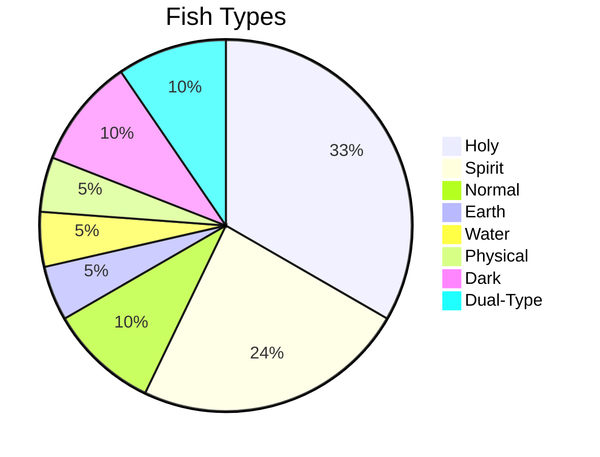

### Combo Attack Matrix

| Apostle | Fish | Combo Name | Effect |
|---------|------|------------|--------|
| Peter | Bass-ilica | Rock Solid Foundation | DEF buff + heal |
| John | Holy Mackerel | Revelation Smack | 200 Holy damage + blind |
| Andrew | Tuna the Other Cheek | Brother's Counter | Reflect all damage |
| Philip | Salmon of Wisdom | Calculated Devastation | Ignore defenses |
| Simon Zealot | Swordfish | Zealot's Blade | 500 damage (once per game) |
| Matthew | Hali-but | Tax the Wicked | Multi-hit + 10x money |
| Judas | Red Herring | Silver Deception | Damage + steal buffs |
| Thomas | Leviathan's Lament | Proof of Power | 800 single target |
| James Alphaeus | Grouper Therapy | Humble Healing | Full heal all |
| Thaddaeus | Angler of Light | Forgotten Illumination | Reveal secrets |

---

## APOSTLES

**Total Count**: 12 apostles (13 recruitment slots including Judas)

### Apostles Table

| # | ID | Name | Title | Town | Battle Ability | Key Power | Sprite |
|---|----|------|-------|------|----------------|-----------|--------|
| 1 | `bartholomew` | Bartholomew (Nathanael) | The True Israelite | Cana | Fig Tree Wisdom | Illusion Detection | 🖼️ |
| 2 | `peter` | Peter (Simon Peter) | The Rock | Capernaum | Keys to the Kingdom | Stone Moving | 🖼️ |
| 3 | `andrew` | Andrew | The Introducer | Bethsaida | Brother's Keeper | Social Recruitment | 🖼️ |
| 4 | `james_zebedee` | James (son of Zebedee) | Son of Thunder | Magdala | Thunder Strike | Weather Control | 🖼️ |
| 5 | `john` | John | The Beloved | Chorazin | Revelation Vision | Ancient Text Reading | 🖼️ |
| 6 | `philip` | Philip | The Calculator | Tiberias | Feed the 5000 | Mathematical Puzzles | 🖼️ |
| 7 | `matthew` | Matthew (Levi) | The Tax Collector | Gadara | Render unto Caesar | Bribery/Negotiation | 🖼️ |
| 8 | `simon_zealot` | Simon the Zealot | The Revolutionary | Samaria | Righteous Fury | Intimidation | 🖼️ |
| 9 | `james_alphaeus` | James (son of Alphaeus) | The Lesser | Jericho | Humble Service | Humility Gate | 🖼️ |
| 10 | `thomas` | Thomas (Didymus) | The Doubter | Bethany | Proof Required | Trap Detection | 🖼️ |
| 11 | `thaddaeus` | Thaddaeus (Jude) | The Forgotten | Bethlehem | Hidden Strength | Secret Passages | 🖼️ |
| 12 | `judas` | Judas Iscariot | The Betrayer | Jerusalem | Thirty Silver Pieces | Point of No Return | 🖼️ |

### Apostle Recruitment Order


### Apostle Personality Summary (Default Tone)

| Apostle | One-Line Summary |
|---------|------------------|
| Bartholomew | Brutally honest skeptic who apologized twice |
| Peter | Big heart, bigger mouth, impulsive leader |
| Andrew | Professional networker, introduces everyone |
| James (Zebedee) | SON OF THUNDER. LOUD. Wanted to call down fire |
| John | Youngest, beloved, sees deep truths |
| Philip | Excel spreadsheet guy who calculates everything |
| Matthew | Former tax collector, VERY generous now |
| Simon Zealot | Ex-revolutionary learning love > violence |
| James (Alphaeus) | James #2, overlooked, humble, steady |
| Thomas | DOUBTING Thomas, wants proof, then believes HARD |
| Thaddaeus | The forgotten apostle who finds hidden things |
| Judas | Something's OFF. Tragedy waiting to happen |

---

## BOSSES

**Total Count**: 13 bosses (one is 3-phase)

### Bosses Table

| # | ID | Name | Title | Town | Level | HP | Type | Phases | Sprite |
|---|----|------|-------|------|-------|----|----|--------|--------|
| 1 | `steward_feast` | Steward of the Feast | Master of the Wedding | Cana | 5 | 80 | Normal | 1 | 🖼️ |
| 2 | `four_friends` | The Four Friends | Barrier of Doubt | Capernaum | 8 | 100 | Earth | 1 | 🖼️ |
| 3 | `blind_doubters` | Blind Man's Doubters | Chorus of Disbelief | Bethsaida | 12 | 120 | Spirit | 1 | 🖼️ |
| 4 | `seven_demons` | Seven Demons of Magdala | Legion of Torment | Magdala | 15 | 140 | Dark | 1 | 🖼️ |
| 5 | `unrepentant_cities` | Unrepentant Cities | Stone Hearts | Chorazin | 18 | 160 | Holy | 1 | 🖼️ |
| 6 | `herod_antipas` | Herod Antipas | The Fox King | Tiberias | 22 | 180 | Dark | 2 | 🖼️ |
| 7 | `legion_gadarene` | Legion (Gadarene) | The Possessed One | Gadara | 25 | 200 | Dark | 2 | 🖼️ |
| 8 | `five_husbands` | The Five Husbands | Shadows of the Past | Samaria | 28 | 175 | Spirit | 1 | 🖼️ |
| 9 | `rahabs_pursuers` | Rahab's Pursuers | The King's Men | Jericho | 32 | 220 | Normal | 2 | 🖼️ |
| 10 | `death_manifest` | Death Itself | The Final Enemy | Bethany | 35 | 250 | Dark | 1 | 🖼️ |
| 11 | `captain_guard` | Captain of the Guard | The Faithful Centurion | Bethlehem | 38 | 200 | Normal | 1 | 🖼️ |
| 12 | `final_trial` | The Final Trial | Caiaphas → Pilate → Satan | Jerusalem | 42 | 300 | Dark | 3 | 🖼️ |

### Boss Progression Map

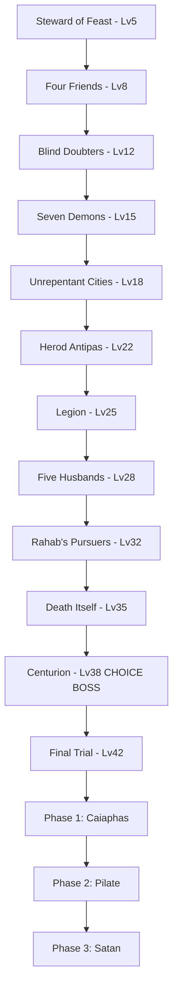

### Boss Gimmicks

| Boss | Unique Mechanic |
|------|----------------|
| Steward | Gets progressively drunker (accuracy ↓) |
| Four Friends | Puzzle boss - defeat 4 segments in order |
| Blind Doubters | Attacks that blind/reduce accuracy |
| Seven Demons | 7 demon stacks, each 20 HP weakens boss |
| Unrepentant | Stone hearts, healing nullified, Holy 1.5x |
| Herod | Phase 2 summons guards |
| Legion | Phase 1: demons, Phase 2: swine charge |
| Five Husbands | 5 segments (35 HP each) change patterns |
| Rahab | Walls fall at 50% HP, AOE damage |
| Death | Power over Lazarus, Holy 2x damage |
| Centurion | **CHOICE**: Fight or Mercy (different outcomes) |
| Final Trial | 3 distinct phases with different mechanics |

---

## ITEMS

**Total Count**: 13 bread items (consumables)

### Items Table

| # | ID | Name | Type | Effect | Power | Cost | Town | Sprite |
|---|----|------|------|--------|-------|------|------|--------|
| 1 | `plain_pita` | Plain Pita | Healing | Heal HP | 20 | 0 | Nazareth | 🖼️ |
| 2 | `ryedemption_roll` | Rye-demption Roll | Healing | Heal HP | 30 | 30 | Cana | 🖼️ |
| 3 | `challah_lujah` | Challah-lujah Bread | Healing | Heal HP | 50 | 50 | Bethsaida | 🖼️ |
| 4 | `naan_business` | Naan of Your Business | Heal+Cure | Heal + Cure Poison | 40 | 60 | Gadara | 🖼️ |
| 5 | `breadgel` | Breadgel | Heal+Buff | Heal + ATK boost | 60 + 10 ATK | 100 | Bethlehem | 🖼️ |
| 6 | `manna_breakfast` | Manna from Breakfast | Full Heal | Full Heal All | 999 | 200 | Jerusalem | 🖼️ |
| 7 | `loaf_divine` | Loaf Divine | Buff ATK | ATK +20% (3 turns) | - | 40 | Capernaum | 🖼️ |
| 8 | `focaccia_blessing` | Focaccia Blessing | Buff SPD | SPD +40% (3 turns) | - | 55 | Tiberias | 🖼️ |
| 9 | `pumpernickel_dime` | Pumper-nickel and Dime | Buff DEF | DEF +30% (4 turns) | - | 65 | Samaria | 🖼️ |
| 10 | `sourdough_sorrow` | Sourdough of Sorrow | Debuff | Enemy ATK -30% (3t) | - | 50 | Magdala | 🖼️ |
| 11 | `unleavened_legend` | Unleavened Legend | Cure All | Remove All Debuffs | - | 70 | Chorazin | 🖼️ |
| 12 | `bagel_second_chances` | Bagel of Second Chances | Auto-Revive | Revive at 1 HP | - | 150 | Jericho | 🖼️ |
| 13 | `croissant_crusader` | Croissant Crusader | Invincibility | Invincible (3 turns) | - | 180 | Bethany | 🖼️ |

### Item Categories

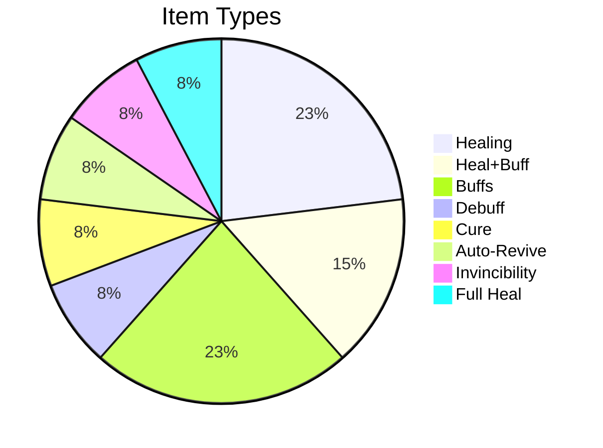

---

## QUESTS

**Total Count**: 46 quests across 5 types

### Quest Types Distribution

| Type | Count | Description |
|------|-------|-------------|
| Tutorial | 3 | Teach game mechanics |
| Story | 12 | Main storyline progression |
| Side | 15 | Optional character quests |
| Teaching | 8 | Parable-based lessons |
| Collection | 8 | Gather/defeat specific targets |

### Main Story Quest Chain

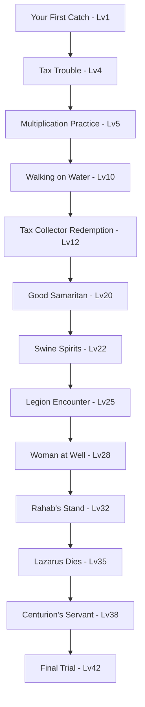

### Quest Table (Key Quests)

| # | ID | Name | Type | Region | Level | Objectives | Sprite |
|---|----|------|------|--------|-------|-----------|--------|
| 1 | `first_catch` | Your First Catch | Tutorial | Galilee | 1 | Catch 1 fish | 🖼️ |
| 2 | `doubting_thomas` | Doubting Thomas | Side | Galilee | 3 | Show 3 fish types | 🖼️ |
| 3 | `lost_sheep_roundup` | Lost Sheep Roundup | Collection | Galilee | 2 | Defeat 5 Lost Sheep | 🖼️ |
| 4 | `tax_trouble` | Tax Trouble | Story | Galilee | 4 | Catch fish with coin | 🖼️ |
| 5 | `multiplication_practice` | Multiplication Practice | Teaching | Galilee | 5 | Use 5 bread items | 🖼️ |
| 6 | `walking_on_water` | Walking on Water | Challenge | Coastal | 10 | Defeat 5 Water Spirits | 🖼️ |
| 10 | `good_samaritan` | Good Samaritan | Teaching | Gentile | 20 | Heal + defeat bandits | 🖼️ |
| 15 | `final_trial` | The Final Trial | Story | Jerusalem | 42 | Boss gauntlet | 🖼️ |

**Note**: Full quest list with 46 entries in `src/data/quests.json`

### Quest Rewards Structure

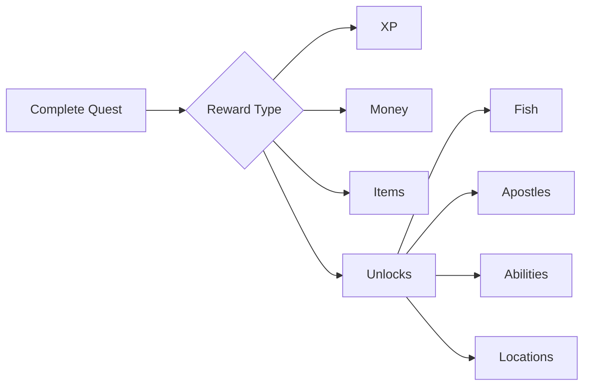

---

## ENEMIES

**Total Count**: 40 enemy types

### Enemy Categories

| Category | Count | Examples |
|----------|-------|----------|
| Wildlife | 8 | Lost Sheep, Wild Boar, Desert Scorpion |
| Hostile NPCs | 12 | Wild Bandit, Tax Collector Shade, Roman Scout |
| Religious Opposition | 8 | Questioning Pharisee, Skeptical Scholar, Sadducee |
| Spiritual | 12 | Wheat Wisp, Water Spirit, Swine Spirit, Possessed Merchant |

### Enemy Table (Sample - Top 20)

| # | ID | Name | Type | HP | ATK | DEF | Region | Sprite |
|---|----|------|------|----|----|-----|--------|--------|
| 1 | `lost_sheep` | Lost Sheep | Normal | 15 | 5 | 4 | Galilee | 🖼️ |
| 2 | `wild_bandit` | Wild Bandit | Physical | 25 | 10 | 6 | Galilee | 🖼️ |
| 3 | `questioning_pharisee` | Questioning Pharisee | Spirit | 30 | 12 | 10 | Galilee | 🖼️ |
| 4 | `wheat_wisp` | Wheat Wisp | Earth | 20 | 8 | 8 | Galilee | 🖼️ |
| 5 | `tax_collector_shade` | Tax Collector Shade | Dark | 35 | 14 | 8 | Coastal | 🖼️ |
| 6 | `possessed_merchant` | Possessed Merchant | Dark | 40 | 16 | 10 | Coastal | 🖼️ |
| 7 | `roman_scout` | Roman Scout | Physical | 45 | 18 | 14 | Coastal | 🖼️ |
| 8 | `herodian_guard` | Herodian Guard | Physical | 50 | 20 | 16 | Coastal | 🖼️ |
| 9 | `corrupt_official` | Corrupt Official | Normal | 42 | 16 | 12 | Coastal | 🖼️ |
| 10 | `swine_spirit` | Swine Spirit | Dark | 38 | 15 | 8 | Gentile | 🖼️ |
| ... | ... | ... | ... | ... | ... | ... | ... | ... |

**Note**: Complete enemy list in `src/data/enemies.json` (to be created/documented)

### Enemy Encounter Rates

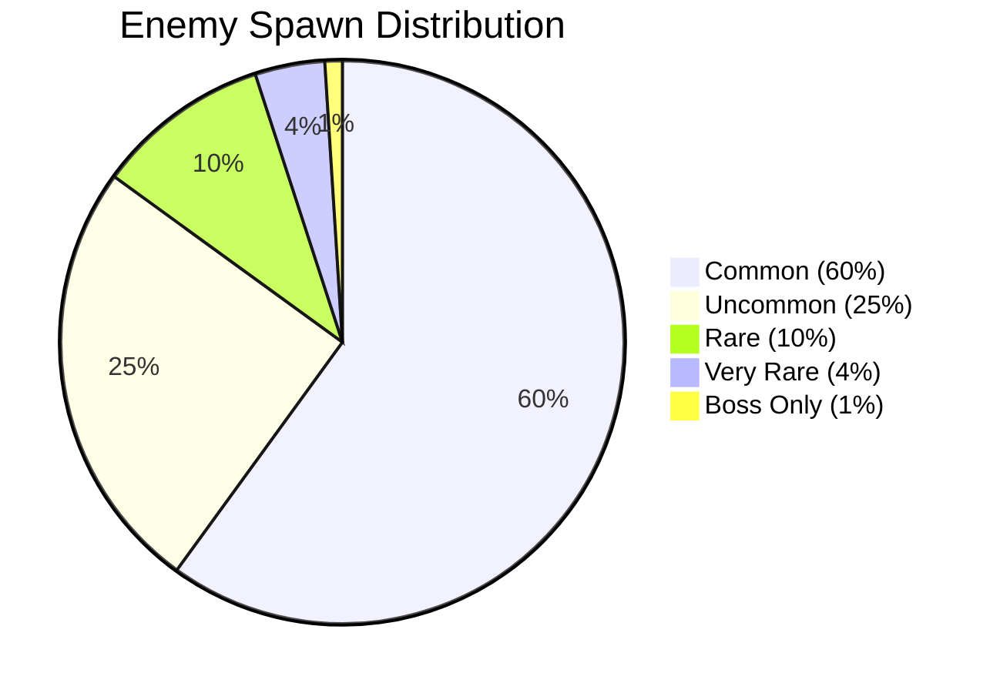

---

## TOWNS & LOCATIONS

**Total Count**: 13 towns + overworld

### Town Map

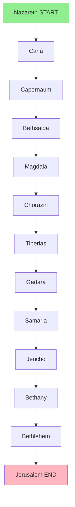

### Town Details Table

| # | Town | Region | Level Range | Key Features | Sprite/Map |
|---|------|--------|-------------|--------------|------------|
| 1 | Nazareth | Galilee | 1-3 | Starting town, carpenter's shop, Joseph | 🗺️ |
| 2 | Cana | Galilee | 3-6 | Wedding venue, first miracle, wine shop | 🗺️ |
| 3 | Capernaum | Galilee | 5-8 | Peter's house, fishing port, synagogue | 🗺️ |
| 4 | Bethsaida | Coastal | 7-10 | Andrew's hometown, fishing village | 🗺️ |
| 5 | Magdala | Coastal | 10-14 | Mary Magdalene, trade hub | 🗺️ |
| 6 | Chorazin | Coastal | 12-16 | Unrepentant city, stone hearts | 🗺️ |
| 7 | Tiberias | Coastal | 15-20 | Herod's palace, Roman influence | 🗺️ |
| 8 | Gadara | Gentile | 18-23 | Demon territory, pig farms | 🗺️ |
| 9 | Samaria | Gentile | 22-28 | Well, woman's past, cultural divide | 🗺️ |
| 10 | Jericho | Gentile | 25-32 | Walls of Jericho, Rahab's house | 🗺️ |
| 11 | Bethany | Judea | 30-36 | Lazarus's tomb, Mary & Martha | 🗺️ |
| 12 | Bethlehem | Judea | 35-40 | Birthplace, quiet village | 🗺️ |
| 13 | Jerusalem | Judea | 40-42 | Temple, final trials, Judas betrayal | 🗺️ |

### Regional Map Overview

```
         [Galilee Region]
    Nazareth → Cana → Capernaum
                        ↓
         [Coastal Region]
    Bethsaida → Magdala → Chorazin → Tiberias
                                        ↓
                            [Gentile Territories]
                        Gadara → Samaria → Jericho
                                              ↓
                                  [Judea Region]
                            Bethany → Bethlehem → Jerusalem
```

---

## PARABLES

**Total Count**: 40 parables with teaching moments

### Parable Categories

| Category | Count | Examples |
|----------|-------|----------|
| Kingdom Parables | 10 | Mustard Seed, Hidden Treasure, Pearl |
| Character Parables | 8 | Good Samaritan, Prodigal Son, Pharisee & Tax Collector |
| Agricultural | 10 | Sower, Wheat & Tares, Fig Tree |
| Economic | 7 | Talents, Workers in Vineyard, Unjust Steward |
| Eschatological | 5 | Ten Virgins, Sheep & Goats, Wedding Feast |

### Parable Structure

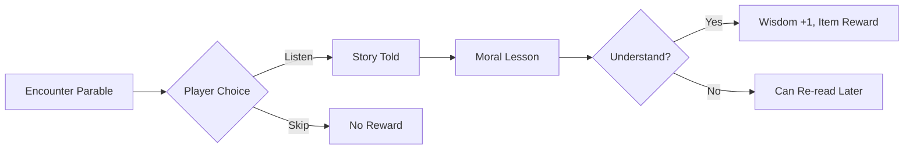

### Key Parables Table (Sample)

| # | ID | Name | Category | Lesson | Reward | Sprite |
|---|----|------|----------|--------|--------|--------|
| 1 | `sower` | The Sower | Agricultural | Be good soil | Seed Bag | 🖼️ |
| 2 | `mustard_seed` | Mustard Seed | Kingdom | Small → Large | Faith Token | 🖼️ |
| 3 | `good_samaritan` | Good Samaritan | Character | Love neighbor | Samaritan Salve | 🖼️ |
| 4 | `prodigal_son` | Prodigal Son | Character | Forgiveness | Father's Ring | 🖼️ |
| 5 | `talents` | The Talents | Economic | Use gifts | Talent Coin | 🖼️ |
| ... | ... | ... | ... | ... | ... | ... |

**Note**: Full parable list in `src/data/parables.json` (to be completed with dual-text)

---

## GAME SYSTEMS

### Battle System Flow

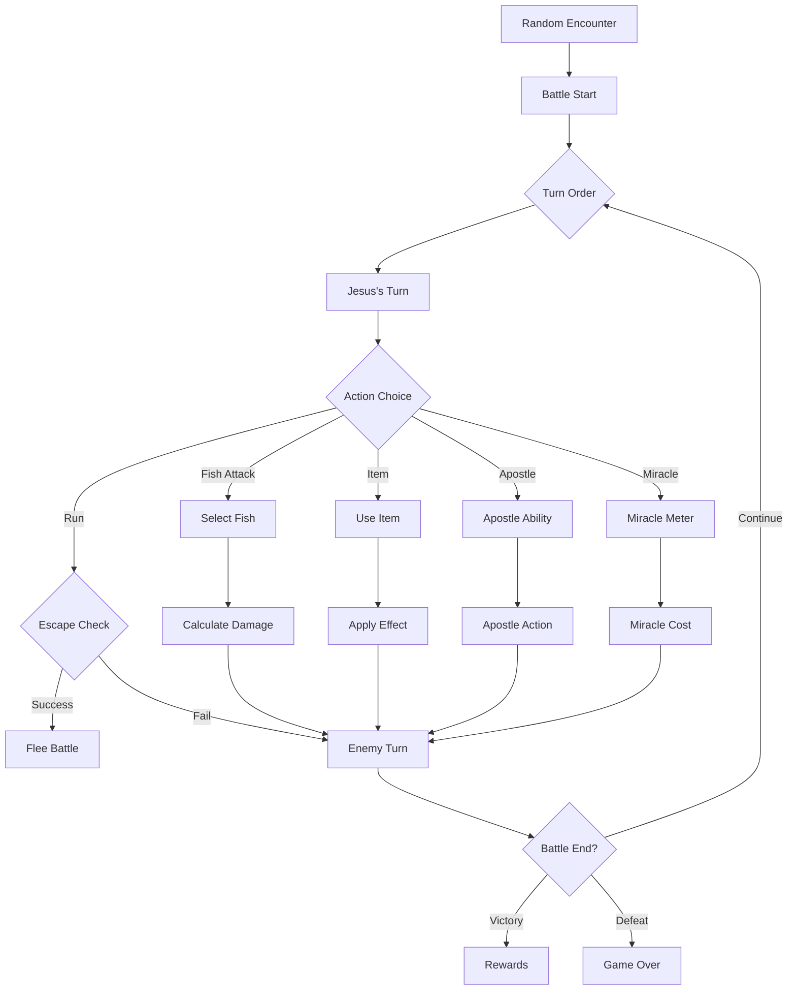

### Miracle Meter System

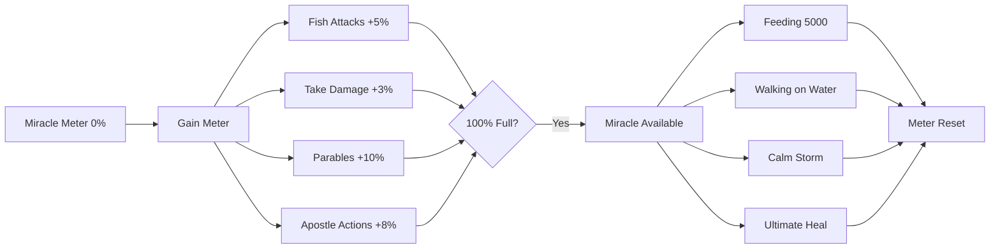

### Progression System

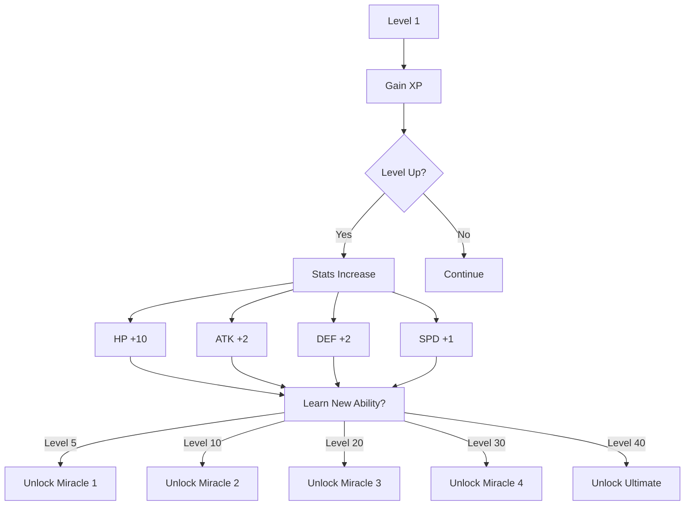

### Fish Team System

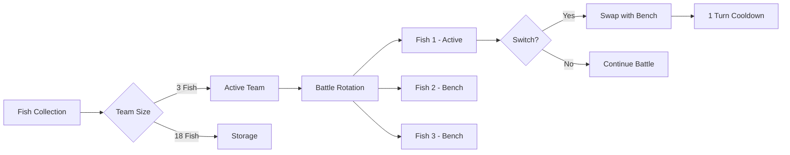

---

## UI SCREENS

### Main Menu

```
┌─────────────────────────────────────┐
│      LOAVES AND FISHES             │
│                                     │
│      [NEW GAME]                     │
│      [CONTINUE]                     │
│      [OPTIONS]                      │
│      [CREDITS]                      │
│                                     │
│   🐟 Press START 🐟                 │
└─────────────────────────────────────┘
```
**Sprite Placeholder**: Main menu background 🖼️

### Overworld HUD

```
┌─────────────────────────────────────┐
│ Jesus  HP: ████████░░ 80/100        │
│ Level: 15  XP: ██████░░░░ 450/600   │
│ Miracle: ████░░░░░░░░ 40%           │
├─────────────────────────────────────┤
│ Active Fish:                         │
│ 🐟 Holy Mackerel  HP: 38/40         │
│ 🐟 Bass-ilica     HP: 35/35         │
│ 🐟 Carp Diem      HP: 22/25         │
├─────────────────────────────────────┤
│ Location: Capernaum                  │
│ Money: 450 ⊕                         │
└─────────────────────────────────────┘
```

### Battle Screen Layout

```
┌──────────────────────────────────────────┐
│  [Enemy]  Wild Bandit  HP: ████░░ 20/25 │
│     🗡️                                   │
├──────────────────────────────────────────┤
│                                          │
│  [Jesus]  HP: ████████ 80/100           │
│  🧔                                      │
│                                          │
│  [Fish]  🐟 Holy Mackerel  HP: 38/40    │
│                                          │
├──────────────────────────────────────────┤
│  [ATTACK] [ITEM] [APOSTLE] [MIRACLE]    │
│  [RUN]    Miracle: ████░░ 40%           │
└──────────────────────────────────────────┘
```

### Fish Collection Screen

```
┌─────────────────────────────────────────┐
│         FISH COLLECTION                 │
├─────────────────────────────────────────┤
│ [1] 🐟 Starter Sardine     ⭐ Active    │
│ [2] 🐟 Carp Diem          ⭐ Active    │
│ [3] 🐟 Holy Mackerel      ⭐ Active    │
│ [4] 🐟 Bass-ilica         ○ Bench      │
│ [5] 🐟 Sole Survivor      ○ Bench      │
│ [6] ❓ ???                ○ Locked     │
│ [7-21] ...                              │
├─────────────────────────────────────────┤
│ A: Select  B: Back  X: Details  Y: Swap │
└─────────────────────────────────────────┘
```

### Apostle Menu

```
┌─────────────────────────────────────────┐
│         APOSTLE ROSTER                  │
├─────────────────────────────────────────┤
│ [1] Peter          ⭐ Active            │
│     "The Rock"                          │
│     Ability: Keys to the Kingdom        │
│                                         │
│ [2] Andrew         ⭐ Active            │
│     "The Introducer"                    │
│     Ability: Brother's Keeper           │
│                                         │
│ [3] John           ○ Inactive           │
│     "The Beloved"                       │
│     Ability: Revelation Vision          │
│                                         │
│ [4-12] ...                              │
├─────────────────────────────────────────┤
│ A: Select  B: Back  X: Bio  Y: Equip   │
└─────────────────────────────────────────┘
```

### Shop Interface

```
┌─────────────────────────────────────────┐
│      CAPERNAUM FISHMONGER               │
├─────────────────────────────────────────┤
│ [1] Carp Diem           50 ⊕           │
│     Tier 1 Earth Fish                   │
│                                         │
│ [2] Sole Survivor       100 ⊕          │
│     Tier 1 Holy Fish                    │
│                                         │
│ [3] Challah-lujah Bread 50 ⊕           │
│     Heals 50 HP                         │
│                                         │
│ Your Money: 450 ⊕                       │
├─────────────────────────────────────────┤
│ A: Buy  B: Exit  X: Details             │
└─────────────────────────────────────────┘
```

---

## SPRITE & ASSET SPECIFICATIONS

### Character Sprites

- **Dimensions**: 32x48 pixels (character), 64x64 pixels (portrait)
- **Format**: PNG with transparency
- **Animation Frames**: 4 (idle, walk, battle, victory)
- **Color Palette**: Warm, biblical-era tones

### Fish Sprites

- **Dimensions**: 48x48 pixels
- **Format**: PNG with transparency
- **Animation**: 2-frame idle animation
- **Special Effects**: Glow/aura for rare fish

### Enemy Sprites

- **Dimensions**: 48x48 (small), 64x64 (medium), 96x96 (large bosses)
- **Format**: PNG with transparency
- **Animation**: 3-frame (idle, attack, hurt)

### Environment Tiles

- **Dimensions**: 16x16 pixels (tiles), 32x32 (objects)
- **Format**: PNG tileset
- **Terrain Types**: Grass, sand, water, stone, buildings

### UI Elements

- **Format**: PNG with transparency
- **Font**: Monospace pixel font, 8pt
- **Color Scheme**:
  - Default: Dark blues, whites, gold accents
  - Christian Edition: Whites, golds, soft pastels

---

## ADDING NEW ELEMENTS - REQUIREMENTS

### ⚠️ MANDATORY PROCESS FOR ALL NEW CONTENT

When adding **ANY** new user-facing element to the game, you **MUST**:

1. ✅ **Add entry to this document** (GAME_ELEMENTS.md)
   - Include in appropriate table
   - Add sprite placeholder 🖼️
   - Document stats/mechanics

2. ✅ **Implement dual-text** (if applicable)
   - Add both `default` and `christian_edition` versions
   - Follow TONE_GUIDE.md guidelines
   - Default: Irreverent, funny, snarky
   - Christian Edition: Reverent, educational

3. ✅ **Update flowcharts/diagrams** (if affects game flow)
   - Use Mermaid syntax
   - Show connections to existing systems

4. ✅ **Add to data files**
   - JSON files in `src/data/`
   - Follow existing schema structure

5. ✅ **Document acquisition method**
   - How does player obtain this?
   - Level requirements?
   - Prerequisites?

### Element-Specific Requirements

#### New Fish
- [ ] Stats table entry with HP/ATK/DEF/SPD
- [ ] Dual-text `flavor_text`
- [ ] Acquisition method (shop/quest/encounter)
- [ ] Type and tier classification
- [ ] Combo attack (if applicable)
- [ ] 48x48 sprite placeholder

#### New Apostle
- [ ] Stats table with town and abilities
- [ ] Dual-text `personality` and `recruitment_event`
- [ ] Battle ability description
- [ ] Key power (overworld ability)
- [ ] Recruitment order in flowchart
- [ ] 32x48 character sprite + 64x64 portrait

#### New Boss
- [ ] Stats table with HP/ATK/level
- [ ] Dual-text `intro_dialogue` and `defeat_dialogue`
- [ ] Gimmick/mechanic description
- [ ] Phase transitions (if multi-phase)
- [ ] Biblical reference
- [ ] Boss progression flowchart update
- [ ] 96x96 sprite placeholder

#### New Item
- [ ] Stats table with effect and cost
- [ ] Dual-text `flavor_text`
- [ ] Item category (healing/buff/debuff/special)
- [ ] Shop availability
- [ ] 32x32 sprite placeholder

#### New Quest
- [ ] Quest table entry with type/level/region
- [ ] Dual-text `dialogue` (start and complete)
- [ ] Objectives list
- [ ] Rewards breakdown
- [ ] Quest chain flowchart (if story quest)
- [ ] UI mockup for quest tracker

#### New Enemy
- [ ] Stats table with HP/ATK/DEF/type
- [ ] Dual-text `flavor_text`
- [ ] Spawn locations and rates
- [ ] Drop table
- [ ] 48x48 or 64x64 sprite placeholder

#### New Town/Location
- [ ] Town table with level range
- [ ] Key features and NPCs
- [ ] Shop inventory
- [ ] Quest availability
- [ ] Town map flowchart update
- [ ] 🗺️ map placeholder

#### New Parable
- [ ] Parable table with category
- [ ] Dual-text `intro` and `moral`
- [ ] Lesson/teaching
- [ ] Reward item
- [ ] Where encountered
- [ ] 🖼️ illustration placeholder

---

## VERSION HISTORY

| Date | Version | Changes |
|------|---------|---------|
| 2025-12-10 | 1.0 | Initial documentation created |
|  |  | - 21 fish documented |
|  |  | - 12 apostles documented |
|  |  | - 13 bosses documented |
|  |  | - 13 items documented |
|  |  | - Quest structure defined |
|  |  | - Enemy categories outlined |
|  |  | - Town map created |
|  |  | - Parable framework added |
|  |  | - Game systems flow documented |
|  |  | - UI mockups added |

---

## NOTES

- All sprite placeholders (🖼️ 🗺️) should be replaced with actual asset paths once created
- Mermaid flowcharts can be rendered in GitHub markdown viewers
- This document should be updated **before** implementing new content
- Cross-reference with TONE_GUIDE.md for writing guidelines
- Use this as the single source of truth for all game elements

---

**End of Documentation**
*For tone guidelines, see TONE_GUIDE.md*
*For implementation status, see STATUS.md and ROADMAP.md*
